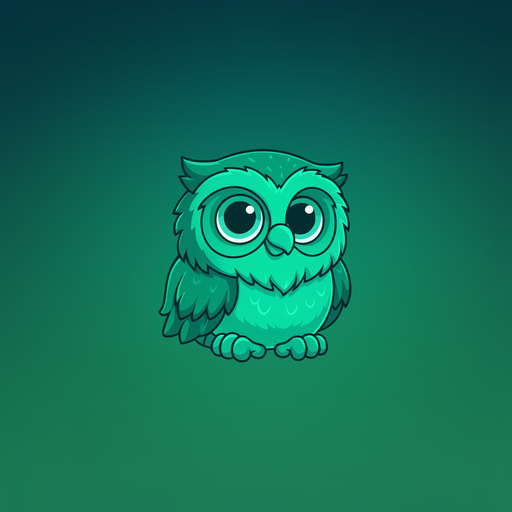
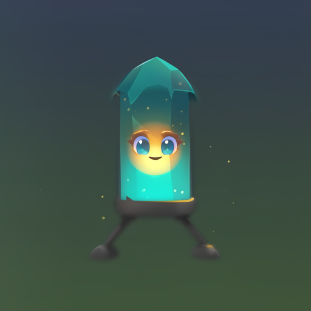
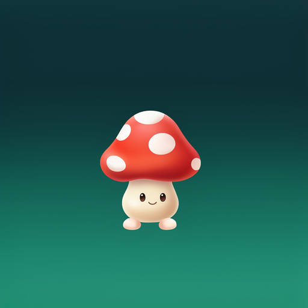
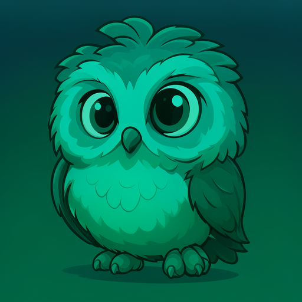
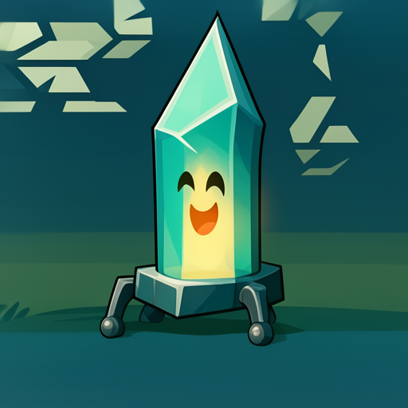
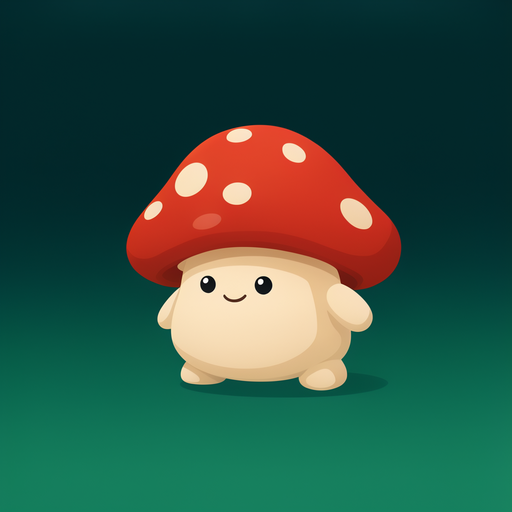

# Ideogram Cartoon LoRA

An Ideogram 4 LoRA for clean, chunky, readable cartoon game-asset art.

Weights: [Snip130/ideogram-cartoon-lora](https://huggingface.co/Snip130/ideogram-cartoon-lora)

## Samples

Base model vs. the trained LoRA at the same prompt and seed. The owl and
mushroom are pure text-to-image; the crystal lantern is image-to-image from a
rough sketch.

| | Owl | Crystal Lantern | Mushroom |
| --- | --- | --- | --- |
| **Base, no LoRA** |  |  |  |
| **With LoRA** |  |  |  |

## Quick Start

You need:

- Python 3.11+
- A local [AI Toolkit](https://github.com/ostris/ai-toolkit) checkout
- Access to `ideogram-ai/ideogram-4-fp8` on Hugging Face
- A GPU/MPS setup that can run Ideogram 4

Clone this repo next to AI Toolkit:

```bash
git clone https://github.com/ChaseC-130/Ideogram-Cartoon-Lora.git
cd Ideogram-Cartoon-Lora
python3 -m venv .venv
source .venv/bin/activate
pip install -r requirements.txt
```

Authenticate with Hugging Face if needed:

```bash
./venv/bin/hf auth login
```

Download the LoRA weights:

```bash
mkdir -p weights
./venv/bin/hf download Snip130/ideogram-cartoon-lora \
  ideogram_cartoon_lora.safetensors \
  --local-dir weights
```

Run the included sample batch:

```bash
python scripts/batch_img2img_all.py \
  --ai-toolkit-path ../ai-toolkit \
  --source-dir samples/source_images \
  --prompt-cache samples/prompt_cache.json \
  --clean-prompt-cache samples/prompt_cache.json \
  --lora-path weights/ideogram_cartoon_lora.safetensors \
  --output-dir output/sample_generated \
  --steps 20 \
  --guidance 3.6 \
  --strength 0.88 \
  --device mps \
  --seed 21
```

Outputs land in:

```text
output/sample_generated
```

Use `--device cuda` instead of `--device mps` on NVIDIA.

## Run Your Own Image

```bash
python scripts/run_image_to_image.py \
  --ai-toolkit-path ../ai-toolkit \
  --image_path /absolute/path/to/source.png \
  --prompt "cartoon game asset of the subject, clean cel-shaded edges, vibrant colors, no text, no letters" \
  --lora_path weights/ideogram_cartoon_lora.safetensors \
  --output_path output/my_image.png \
  --strength 0.88 \
  --steps 20 \
  --guidance 3.6 \
  --device mps \
  --seed 21
```

## Text To Image (No Source)

The owl and mushroom samples are generated straight from a prompt, with no
source image:

```bash
python scripts/txt2img_clean.py \
  --ai-toolkit-path ../ai-toolkit \
  --lora-path weights/ideogram_cartoon_lora.safetensors \
  --prompt "A cute round owl mascot with big friendly eyes, soft layered feathers, perched on a soft dark teal-to-forest-green gradient background, chunky readable silhouette, clean cel-shaded edges, vibrant cartoon game asset style, no text or letters." \
  --slug owl \
  --output-dir output/txt2img \
  --size 1024 --steps 28 --guidance 3.5 --device mps --seed 42
```

Add `--no-lora` for the base-model comparison.

## Compare Against The Base Model

Run the same sample batch without the adapter:

```bash
python scripts/batch_img2img_all.py \
  --ai-toolkit-path ../ai-toolkit \
  --source-dir samples/source_images \
  --prompt-cache samples/prompt_cache.json \
  --clean-prompt-cache samples/prompt_cache.json \
  --output-dir output/sample_generated_base \
  --steps 20 \
  --guidance 3.6 \
  --strength 0.88 \
  --device mps \
  --seed 21 \
  --no-lora
```

## Useful Files

- `samples/source_images/`: source sketch for the image-to-image sample
- `samples/generated/`: LoRA sample outputs
- `samples/generated_base/`: no-LoRA comparison outputs
- `samples/prompt_cache.json`: prompts for the image-to-image sample batch
- `samples/txt2img_prompts.json`: prompts for the text-to-image samples
- `scripts/run_image_to_image.py`: one image, image-to-image
- `scripts/batch_img2img_all.py`: many images, image-to-image
- `scripts/txt2img_clean.py`: text-to-image (no source)
- `config/*.example.yaml`: optional training config templates

## License Notes

The code in this repo is MIT licensed. The LoRA is a derivative of
`ideogram-ai/ideogram-4-fp8`, so use of the adapter must also follow Ideogram's
base model terms.
