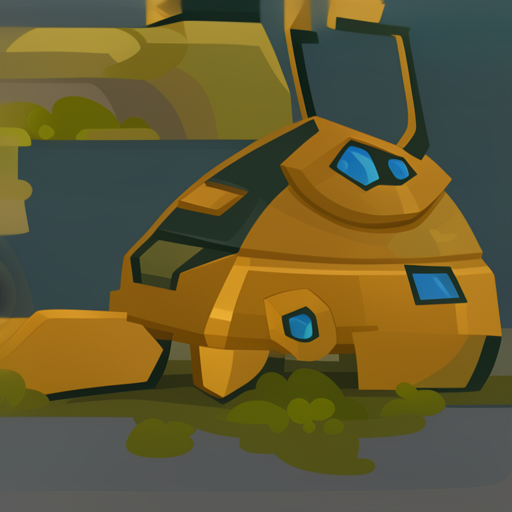
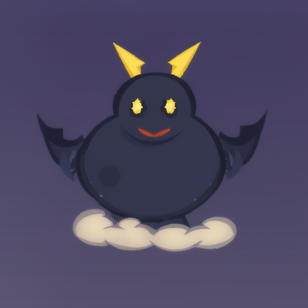

# Ideogram Cartoon LoRA Workflow

Reusable scripts for training and running an Ideogram 4 LoRA image workflow. The
repo is intentionally code-first: source images, generated outputs, private
project recipes, local checkpoints, and LoRA weights are ignored by default.

## What Is Included

- Generic LoRA training config templates for AI Toolkit.
- Caption and prompt-cache helpers.
- Ideogram 4 text-to-image and image-to-image runners.
- Batch img2img with optional blur preprocessing.
- Lightweight post-processing/refinement.
- Optional VOSR orchestration for unblur/upscale passes.

## What Is Not Included

- Training images or captions.
- Generated image outputs.
- LoRA weight files.
- Base model checkpoints.
- Private project-specific batch recipes.
- API keys, Hugging Face tokens, or local machine paths.

## Setup

Clone this repo next to a local AI Toolkit checkout, or point
`AI_TOOLKIT_PATH` at your checkout:

```bash
python3 -m venv .venv
source .venv/bin/activate
pip install -r requirements.txt
cp .env.example .env
```

If you use Ideogram 4 weights from Hugging Face, accept the model gate and
authenticate with `hf auth login` or `HF_TOKEN`. The public Ideogram 4 weights
are governed by Ideogram's model license, which is separate from this repo's
code license.

## Train A LoRA

Create a local config from one of the templates:

```bash
cp config/train_lora.example.yaml config/train_lora.yaml
```

Edit the local config paths for your AI Toolkit checkout and dataset. Then run
AI Toolkit from its repo:

```bash
cd ../ai-toolkit
python run.py ../Ideogram-Cartoon-Lora/config/train_lora.yaml
```

## Generate Captions

Put training images in a local ignored dataset folder, then create JSON captions:

```bash
python scripts/label_images.py --mode auto
```

For simple placeholder captions from filenames:

```bash
python scripts/prepare_dataset_v2.py --dataset-dir dataset_v2
```

## One Image To Image

```bash
python scripts/run_image_to_image.py \
  --ai-toolkit-path ../ai-toolkit \
  --image_path /absolute/path/to/source.png \
  --prompt "cartoon game asset of the subject, clean cel-shaded edges, vibrant colors, no text" \
  --lora_path /absolute/path/to/lora.safetensors \
  --output_path output/e2e/example/generated.png \
  --strength 0.70 \
  --steps 28 \
  --guidance 3.5 \
  --device mps \
  --seed 42
```

## Batch Image To Image

Create or provide a prompt cache keyed by paths relative to your source folder:

```json
{
  "example.png": "cartoon game asset of a bright brass robot, no text"
}
```

Then run:

```bash
python scripts/batch_img2img_all.py \
  --ai-toolkit-path ../ai-toolkit \
  --source-dir input/images \
  --prompt-cache output/img2img_prompts.json \
  --lora-path weights/cartoon_lora.safetensors \
  --output-dir output/img2img_assets \
  --limit 5
```

## Samples

The repo includes three synthetic source sketches, prompts, and generated
sample outputs. These are small 512px examples intended to make the workflow
easy to try end to end.

| Clockwork beetle | Crystal lantern | Storm dragon |
| --- | --- | --- |
|  |  |  |

Recreate the samples after downloading the LoRA weights:

```bash
python scripts/batch_img2img_all.py \
  --ai-toolkit-path ../ai-toolkit \
  --source-dir samples/source_images \
  --prompt-cache samples/prompt_cache.json \
  --clean-prompt-cache samples/prompt_cache.json \
  --lora-path weights/ideogram_cartoon_lora.safetensors \
  --output-dir output/sample_generated \
  --steps 20 \
  --guidance 3.6 \
  --strength 0.88 \
  --device mps \
  --seed 21
```

## Refine And VOSR

```bash
python scripts/refine_img2img_assets.py \
  --generated-dir output/img2img_assets \
  --original-dir input/images \
  --output-dir output/img2img_assets_refined \
  --overwrite
```

VOSR is optional. If you use it, keep the checkout and checkpoints local under
`external/VOSR` or set up your own pathing around `scripts/run_vosr.sh`.

```bash
python scripts/vosr_process_all.py \
  --source output/img2img_assets_refined \
  --output output/vosr_img2img_assets_refined \
  --force
```

## Publishing Weights

Prefer publishing LoRA weights as a Hugging Face model/adapters repo rather
than committing them to GitHub. Include a model card that names the base model,
training data rights, intended use, and license compatibility. See
`MODEL_CARD_TEMPLATE.md`.

This project's Hugging Face model-card draft lives at `huggingface/README.md`.
